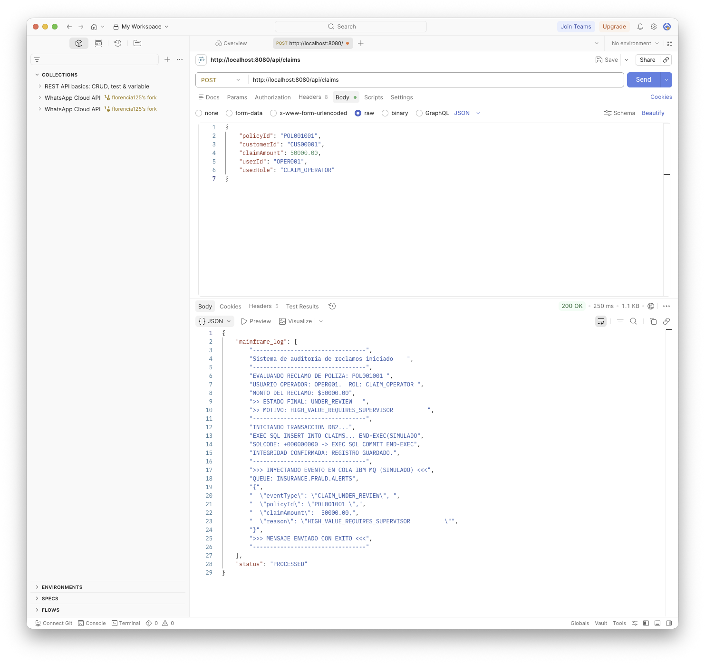
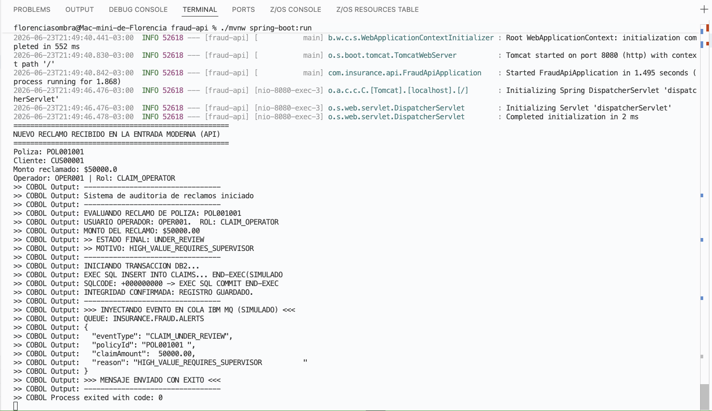
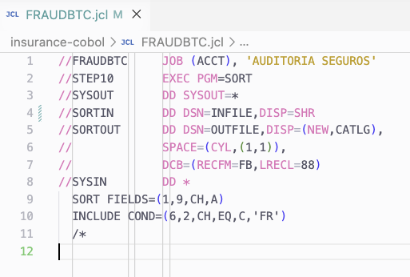
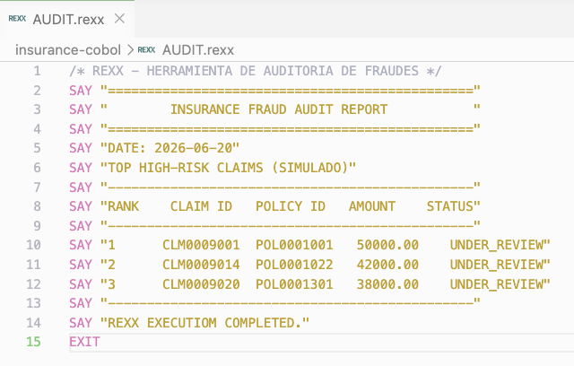

# 🛡️ Insurance Claims Fraud Audit Modernization

> **Architecture Note & Scope:** *This project implements the core fraud audit workflow and documents the IBM Z integration points. Some components such as RACF, IBM MQ, CICS transactions, and DFSORT are represented through architecture-level simulations (console mocks) to demonstrate the integration flow without requiring a full z/OS environment.*

## 📖 Project Overview
Modernización legacy para detección y auditoría de fraude en reclamos de seguros. Este MVP demuestra la integración de una arquitectura moderna (microservicios REST) con un core transaccional robusto en COBOL, priorizando la validación de reglas de negocio y la simulación de transaccionalidad ACID.

## 🏗️ Architecture & Business Flow
El sistema procesa reclamos de seguros mediante el siguiente flujo End-to-End:

1. **REST API (Modern Entry Point):** Una API desarrollada en Spring Boot (Java) expone el endpoint que recibe el JSON del reclamo desde el exterior.
2. **The Hybrid Bridge:** El controlador Java actúa como orquestador, invocando de forma asíncrona al binario compilado de COBOL (`ProcessBuilder`) y capturando su salida estándar.
3. **COBOL Validation (The Core):** Un programa estructurado en COBOL procesa el input y valida las reglas de negocio, evaluando el perfil del operador. Montos mayores a $10,000 USD procesados por operadores básicos disparan un estado de `UNDER_REVIEW`.
4. **Db2 Transactional Persistence:** Simulación de inserción del reclamo evaluando la variable `SQLCODE` para garantizar integridad (`COMMIT` o `ROLLBACK`).
5. **IBM MQ Event Decoupling:** Simulación de publicación de eventos en cola MQ para reclamos de alto riesgo, desacoplando el motor transaccional.
6. **Nightly Batch & Reporting:** Un Job (`JCL/DFSORT`) orquesta el filtrado, y una herramienta interactiva `REXX` expone un reporte limpio a los auditores.

## 💻 Tech Stack
* **Frontend/API:** Java 17, Spring Boot, Postman
* **Mainframe Core:** Enterprise COBOL, JCL, DFSORT, REXX (GnuCOBOL para compilación local)
* **Data & Messaging:** IBM Db2 (Simulado), IBM MQ (Simulado)
* **Development:** VS Code, Zowe / IBM Z Open Editor

## 📸 Execution Evidence

* **Postman Validation:** Petición POST y respuesta del puente híbrido estructurando la salida legacy en un JSON prolijo.
  

* **Java/COBOL Bridge:** Terminal de VS Code mostrando el log transaccional donde Spring Boot orquesta la ejecución del Mainframe.
  

* **Batch Processing:** Código fuente `FRAUDBTC.jcl` demostrando sentencias de control DFSORT.
  

* **Audit Tool:** Ejecución interactiva del script `AUDIT.rexx` listando el Top de reclamos de alto riesgo.
  

## 🚀 How to Run (Local Dev Environment)

1. **Compilar el core de validación (COBOL):**
   Ubicarse en la carpeta contenedora del código legacy y compilar:
   ```bash
   cobc -x claimval.cbl
